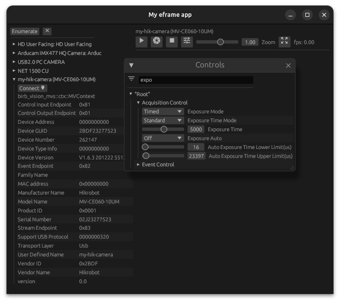

# birb-vision
 A comprehensive Rust library designed for machine vision applications.

`birb-vision` provides a unified interface to interact with various camera systems such as webcams and industrial cameras (including MVS, iCube, Daheng and more). The library aims to simplify the process of camera enumeration, control, and image acquisition, making it easier for developers to build robust vision-based applications.

## Usage

To run the gui example you can use the following command:
```sh
cargo run -p egui-example --release 
```



## Crates

See #7

- [`birb-vision`](./crates/birb-vision/): the core crate
- **interfaces**: some provided interfaces
  - [`birb-vision-fake`](./crates/birb-vision-icube/): fake cameras for testing
  - [`birb-vision-icube`](./crates/birb-vision-icube/): the interface for the iCube cameras
  - [`birb-vision-mvs`](./crates/birb-vision-mvs/): the interface for the MVS cameras
  - [`birb-vision-nokhwa`](./crates/birb-vision-nokhwa/): the interface for the `nokhwa` crate
- [`birb-vision-bundle`](./crates/birb-vision-bundle/): wraps all the interfaces into a single crate
- [`bindings/`](./crates/bindings/): bindings for some camera interfaces
  - [`mvs-sys`](./crates/bindings/mvs-sys): sys crate for the MVS SDK